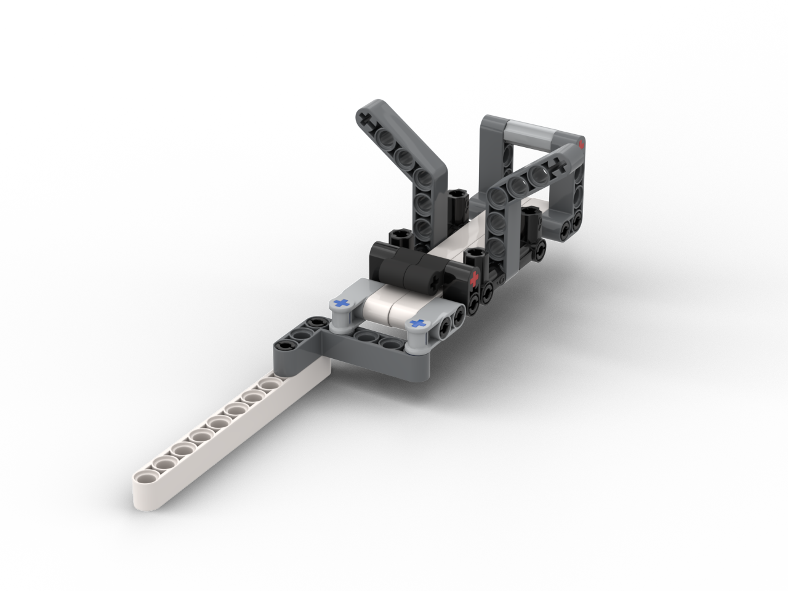

<div style="text-align: center;">
    
</div>

[Video Goes Here]
- background
- problem statement
- solution -- ALBERT
- hardware overview and demonstration (montage of operation, and Studio CAD software)
- software overview montage of coding and downloading (include NXT-G)
- application areas and importance (intuitive voice control and Alexa)

# Alexa-controlled Lego Biological ExpeRimenT (ALBERT) <!-- omit in toc -->

**!! NOTE: Some bacterial growths can be harmful to humans. Please use common sense and safe practices if attempting to build and test this project with real plates. !!**

## Table of Contents <!-- omit in toc -->
- [Background](#background)
- [Problem Statement](#problem-statement)
- [Solution Overview](#solution-overview)
- [Design Problems](#design-problems)
- [Software Architecture](#software-architecture)
- [Build Instructions](#build-instructions)
- [About Me](#about-me)

## Background
Space. The Final Frontier. As NASA prepares to head back to the moon, the ISS has been speeding across the sky at 17,000 mph for the last twenty years, performing untold amounts of scientific research that benefit us right here on earth. One of the key themes of this research has been studying the behavior of life in microgravity, both at the human level and the microscopic scale. As humanity dreams of settling on other planets, we must first rigorously understand how biological organisms operate in microgravity. Will some pathogens, relatively harmless on earth, become dangerous in microgravity? Can artifical organs be grown and manufactured in weightless environments? Just how exactly does space change the function of cells? What medical advances are possible to save lives here on earth?

Space experiments are expensive. A single astronaut's time could be worth [$60,000 to $80,000 per hour](https://www.quora.com/What-is-the-cost-of-an-hour-of-an-ISS-astronauts-time). Many astronauts are not scientists themselves, but engineers and pilots. They receive extensive training and instructional procedures for experiments, but basic science is often not their native discipline. 

In addition, future missions to Mars may find themselves too far from Earth for real-time interaction with mission control to help run or tend to experiments. The crew must be self-supporting and have the help they need to operate the experiments if this is the case.

## Problem Statement
Due to the complexity of running and monitoring experiments in microgravity in Low Earth Orbit (LEO) and during long-duration interplanetary flight, astronauts need an intuitive method of interacting with experiments that abstracts away the need for niche knowledge of the specific scientific field and facilitates simple interaction with minimal training.

## Solution Overview
To solve this solution, I have prototyped ALBERT, or the Alexa-controlled LEGO Biological ExpeRimenT. ALBERT demonstrates the effectiveness of a voice-controlled experiment interface that would allow astronauts to intuitively interact with systems in the absence of continuous communication with mission control and without the need for extensive training.

In it's current form, ALBERT is capable of reacting to voice commands to create new bacterial growth experiments, selecting, swabbing, storing, and monitoring an agar plate. Astronauts need only insert a swab and say, "Alexa, tell ALBERT lab to use this swab." To check an experiment, the crew member can simply ask, "Alexa, tell ALBERT lab to check plate 1."

### Importance of Intuitive Voice Control
ALBERT's intuitive voice control interface is critical to its primary goal -- simplifying the interface to complex experiments to enable virtually untrained crew members to quickly and adeptly create and monitor scientific research. Extensions of the current work will allow dynamic voice interactions with multiple experiments, integration of image processing and datalogging, and critical streamlining of the entire experiment process from launch to landing.

### Why Alexa?
Alexa is the perfect voice-input method for ALBERT. By categorizing commands via intents, Alexa outperforms a simple voice recognition system by its ability to understand the purpose behind an utterance. Additionally, Alexa's ability to integrate with so many other tools and systems opens the door for its use as a unified natural language interface to complex systems such as orbiting laboratories or spacecraft with intuitive interactions.

### Applications
Like many other technologies developed for space exploration, ALBERT's impact can extend far beyond the ISS or interplanetary vehicles. Potential other applications include:
- Automating laboratories on Earth (like [this](https://www.ncbi.nlm.nih.gov/pubmed/30021077))
- Demonstrating the value of integrating laboratories with voice assistants like Alexa for a unified human-laboratory or crew-vehicle interface
- Stimulating the development of fully automated experiment monitoring tools that could leverage new deep learning and AI techniques 

## Design Problems
While building the ALBERT prototype, several key design problems were encountered. They are briefly summarized here along with the chosen solution.

### Rigid Frame
A key concern at the start of the project was ensuring the careful positioning of the necessary sections (workstation, robotic arm, sterile plate storage, and live experiment storage). Misalignment among these components can negatively affect the reliability and repeatability of the procedures. 

To mitigate this, all the key models were secured to an aluminum TETRIX frame.

### Reliable Plate Positioning
LEGO geartrains often experience a large amount of play, making very precision positioning very difficult. However, the plates must be consistently placed on the workstation in a tight area to enable the arm to lift and replace the lids reliably. Additionally, the vertical storage racks have little room for horizontal position errors.

By placing axles as guides at the base of the workstation platter, I could ensure that the plates would be guided down into the platter even in the presence of horizontal manipulator error. To ensure the plates could be consistently vertically stored, angled guides were included in the rack design.

### Swabbing the Plate
To create an experiment plate, the swab cannot simply touch the agar, but must be swiped over some amount of surface area.

Rather than require a second robotic arm to maneuver the swab over the surface of the agar, I elected to directly spin the dish to swab an arc across its surface. Simply by attaching a motor with rubber tire to the workstation allows simple rotating of the dish without the need for a complex assembly.

### Controlling Two Subsystems
To limit complexity, ALBERT is divided into two primary subsystems, the robotic arm and the workstation. ALBERT's primary controller, the EV3 Intelligent Brick, must be able to communicate with the workstation to trigger swab and monitoring operations.

The ev3dev operating system enables the EV3 to remote control the NXT over a USB connection using the `nxt-python` library.

### Two-Position Gripper/Wrist
To store plates vertically and place them horizontally in the workstation requires two arm positions, horizontal and vertical.

A wrist join enables this rotation, but care must be taken to align the wrist rotation axis with the center of the end effector. Misalignment will cause the horizontal and vertical gripper orientations to be slightly offset from each other, causing issues when placing the plate or removing the lid.

### Repeatable Base Positions
The arm must be able to repeatably position itself at the sterile rack, workstation, and storage rack. Originally, this was done with dead reckoning, but for improved performance the EV3 color sensor is used to detect colored stripes as the arm base rotates.

## Software Architecture
The software stack is divided into two major sections: the Alexa-hosted Node.js skill and the Python Alexa Gadget code on the EV3.

### Alexa Skill
The Alexa skill code can be browsed in the `skill` directory. Several key intents are defined and implemented, following the pattern of the sample missions for the LEGO Mindstorms Alexa Challenge.

- `MakePlateIntent` - This intent sends the "make plate" directive to the EV3 gadget
- `CheckPlateIntent` - This intent sends the "check plate" directive to the EV3 gadget along with the number of the plate to check. In most cases, this will be one, but it one be extended to devices with more than one storage rack in the future.
- `GadgetEventHandler` - This handler catches the events returned back from the EV3 gadget to report when a plate has been made or the status of a previously made plate.

### EV3 Python Gagdet Code
The gadget code is designed to receive gadget commands from the cloud-based Alexa skill and activate the ALBERT. This includes a class to encapsulate ALBERT's capability in `albert.py` and a gadget class based off the sample code, written in `albert_gadget.py`. The gadget code is fairly self-explanatory. The ALBERT control code makes extensive use of keypoints defined for the manipulator (arm) to concisely encode the sequence of motions required for each task. These tasks can then be triggered from the gagdet code.

The `workstation.py` file leverages the `nxt-python` library to remote control the NXT over a USB connection. The swab and check plate operations are simple, moving the head into position and rotating the dish if necessary.

## Build Instructions
### 1. Build the Arm

### 2. Build the Workstation

### 3. Build the TETRIX Base and Plate Holders

### 4. Setup ev3dev
- Install `pip3`: `sudo apt install python3-pip`
- Install `pyusb`: `sudo pip3 install pyusb`
- Install `nxt-python`
  ```
  wget https://github.com/ev3dev/nxt-python/archive/ev3dev-stretch.zip
  unzip ev3dev-stretch
  cd nxt-python-ev3dev-stretch
  python3 setup.py install
  ```
### 5. Setup the Alexa Skill (Node.js)
### 6. Code the EV3 Arm & Workstation (Python)

## About Me


Hey! I'm Matthew, and I'm studying machine learning for my Ph.D. at the University of Kentucky and first worked with LEGO MINDSTORMS through the NXT over 10 years ago. Get to know me more on my blog, [mruss.dev](https://mruss.dev)